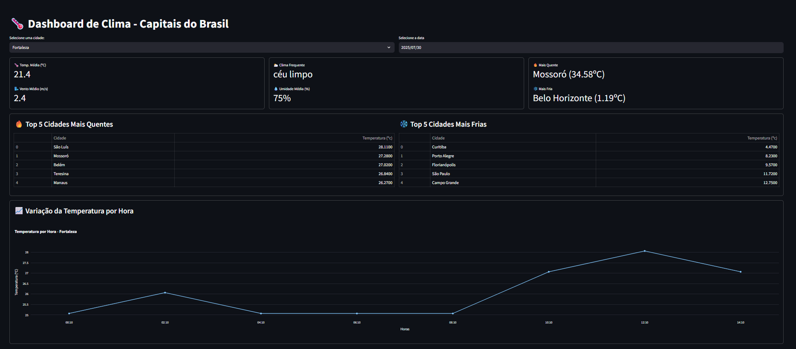

# 🌡️ Dashboard de Temperatura com Streamlit

Este é um projeto pessoal que desenvolvi para monitoramento e visualização de **temperaturas em capitais brasileiras** (e Mossoró, porque é onde moro 😄), utilizando dados em tempo real da API do [OpenWeather](https://openweathermap.org/). O foco foi criar um dashboard interativo, simples e funcional, que pudesse ser executado 100% em Python com Streamlit, sem recorrer a Power BI.

---

## 💡 Motivação

Minha ideia com esse projeto era:

- Colocar em prática conceitos de **engenharia de dados leve**, com orquestração, coleta e disponibilização estruturada.
- Criar uma **visualização interativa** que pudesse ser usada diretamente por qualquer pessoa via browser (usando Streamlit Cloud).
- Desenvolver uma arquitetura simples e escalável para projetos com **Google Sheets + API externa**, aplicando boas práticas de separação de responsabilidades(Entre quem seria responsável pelo Dash e quem seria responsável pela aquisição de dados).

---

## ⚙️ Como Funciona

A arquitetura ficou dividida da seguinte forma:

1. **Google Apps Script** é responsável por:
   - Fazer as requisições à API do OpenWeather.
   - Armazenar os dados em uma planilha do Google Sheets.
   - Orquestrar um fluxo de execução automática a cada 2h para evitar exceder o limite de requisições e registrar logs de erros, acionando uma redundância e mapeando o erro, horário e cidade, para avaliação posterior.
   - Mover dados com mais de 7 dias para uma aba separada (resumo diário).

2. **Google Cloud Platform (GCP)** oferece as credenciais de autenticação para acessar o Google Sheets via Python.

3. **Streamlit + Python**:
   - Lê os dados da planilha.
   - Aplica filtros e cálculos.
   - Exibe os dados em gráficos e tabelas interativas.

---

## 📊 Layout do Dashboard

O layout atual do app conta com os seguintes elementos:

[ Filtro: Data | Cidade ]

[ Métricas principais em 3 ou 4 colunas (6 cards) ]

[ Gráfico: Temperatura por Hora – interativo ]

[ Apresento o TOP 5 cidades mais quentes e mais frias ]

[ Tabela com os dados do dia ]

Alguns elementos ainda estão em desenvolvimento, como o mapa e a parte de tendências históricas, mas o que julgo core do projeto já está pronto!

---

## 🔐 Segurança com Secrets

Como estou usando uma credencial do GCP para acessar o Google Sheets via API:

1. Criei um arquivo `secrets.toml`.
2. Configurei a chave JSON do GCP lá dentro.
3. Fiz o deploy no [Streamlit Cloud](https://streamlit.io/cloud) de forma segura.

---

## 🧠 O que Aprendi:
Uso prático de Streamlit para dashboards.

Integração com Google Sheets via GCP e gspread.

Uso de Apps Script para automações inteligentes e econômicas.

Boas práticas de separação entre coleta e visualização de dados.

### 📌 Tecnologias
Python

Streamlit

Google Sheets + Apps Script

OpenWeather API

Google Cloud Platform

Pandas / Plotly / Matplotlib

### 📸 Print

### 📬 Contato

Se quiser trocar uma ideia sobre o projeto, sugerir melhorias ou colaborações, é só me chamar no [LinkedIn](https://www.linkedin.com/in/anderson-matheuzzz/)! ou [Instagram](https://www.instagram.com/ander_matheuz/profilecard/?igsh=YWdicWhnMGloN2Uz)